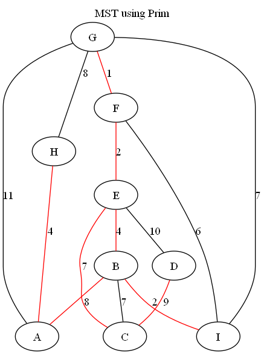

# Graph_Algotihms_and_Visualization
This is a wokring graph visualization and algorithms program that produces outputs to common graph algorithms and images for certain graphs.
It uses the Graphviz library for C++ to generate graph images, but the other algorithms are implemented by me. The program will only compile
for Windows with C++ versions >= 17 because of the Windows Graphviz library used. You can use the same executable, Graph.exe, with the appropriate
flag for directed and undirected graph options. Before running the program, make sure to fill the adjacency list under "Input_File_Templates" for
either. This is detailed in the program as well. 

## Files
1. *Directed.cc* contains the implementation for all algorithms defined in the header
2. *Directed.h* contains the definitions for constructors, methods, and structs used by the Directed class
3. *Undirected.cc* contains the implementation for all algorithms defined in the header 
4. *Undirected.h* contains the definitions for constructors, methods, and structs used by the Undirected class
5. *Main.cc* contains the driver code needed to run the program; displays options,  prompts for user, and calls methods
6. *BaseGraph.h* contains the parent class with the data structures used by child classes and common methods used by Directed and Undirected graphs

## Folders
1. *Graph_PNGs* contains the graph outputs generated by the program and Graphviz as png files; they are named according to what kind of algorithm generated them
2. *Graphviz* contains .lib and .exe files needed to utilize Graphviz in the program; Win32-64 bit version
3. *Graphviz_Files* contains the file used by the program to call Graphviz and generate the graph
4. *Input_File_Templates* contains the templates used for both graphs; the program will read the adjacency list from this folder

## Inputting Adjacency List
Within the *Input_File_Templates* folder, there are two files: *Directed_Template.txt* and *Undirected_Template.txt*. Both follow the same format.
Sample input for a directed graph with 4 vertices and 4 edges:
```
a: [c:7, s:2]
b: [a:5]
c: [s:1]
s: []
```
This represents a directed graph. The four nodes are a, b, c, and d. The edges from a are to c with a weight 7 and to s with weight 2.
If you need more nodes, add more in the same format "node: [edge:weight]." Seperate edges by a comma inside the square brackets.
If nodes do not have outgoing edges, leave the list blank like node s above. Not following this format will result in errors/incorrect results.

Sample input for an undirected graph with 4 vertices and 4 edges:
```
a: [b:5, c:7, s:2]
b: [a:5]
c: [a:7, s:1]
s: [a:2, c:1]
```
This represents an undirected graph. The four nodes are the same and there are 4 edges in the graph. However, as you would with an adjacency list,
you repeat the edges for each vertex. A has an edge to b of weight 5, which is listed in a's list as well as b's list with the same weight.
If a vertex does not have any edges, it means it is not connected to the rest of the graph. Not following this format will result in errors/incorrect results.

## Implementation
For Directed:
  - ShowGraph(): will generate an image of the directed graph from the adjacency list read
  - Dijkstra(): SSSP using Dijkstra's algorithm to print the shortest path as well as the edges in the path and generate graph with the paths colored in red
  - BFS(): performs a BFS starting at a user-inputted vertex and prints the nodes visited in order
  - DFS(): performs a DFS starting at a user-inputted vertex and prints the nodes visited in order
  - AdjacencyMatrix(): prints the adjacency matrix of the graph in console
  - BellmanFord(): SSSP using Bellman-Ford; alternative to Dijkstra SSSP but slower; works with negative edges and detects negative cycles
  - ReverseEdges(): reverses all of the edges in the graph and generates the image of the reversed-graph
  - DetectCycles(): detects if there is a cycle using DFS from a node
  - IsDAG(): calls DetectCycles() and prints if it is a DAG or not
  - SDSP(): SDSP from all nodes to a single destination node; reverse all edges of the graph and call Dijkstra on a node
  - FloydWarshall(): APSP using the Floyd-Warshall algorithm; prints a table in the console for the shortest path for all pairs of nodes
For Undirected:
  - ShowGraph(): will generate an image of the undirected graph from the adjacency list read
  - Dijkstra(): SSSP using Dijkstra's algorithm to print the shortest path as well as the edges in the path and generate graph with the paths colored in red
  - MSTPrim(): MST of the graph using Prim's algorithm to print the edges in the spannning tree and generate graph with the min tree colored in red
  - BFS(): performs a BFS starting at a user-inputted vertex and prints the nodes visited in order
  - DFS(): performs a DFS starting at a user-inputted vertex and prints the nodes visited in order
  - AdjacencyMatrix(): prints the adjacency matrix of the graph in console
  - IsBipartite(): checks to see if the graph has a odd length cycle in the graph
  - FloydWarshall(): APSP using the Floyd-Warshall algorithm; prints a table in the console for the shortest path for all pairs of nodes

## Output
Most outputs are printed on the console, but there are example graphs generated for the Directed, Directed_Reversed, Dijkstra_from_A, Undirected, and MST:

  

  

## Dependencies
- A C++ Compiler (e.g. GCC, G++)

## Compiling
Clone the repository using:
```bash
$ git clone https://github.com/ashsProjects/Graph_Algorithms_and_Visualization.git
```

Compile the program:
```bash
$ g++ -o Graph.exe Main.cc Undirected.cc Directed.cc
```

Run the program:
```bash
$ ./Graph.exe //for help
$ ./Graph.exe -u //for undirected
$ ./Graph.exe -d //for directed
```
